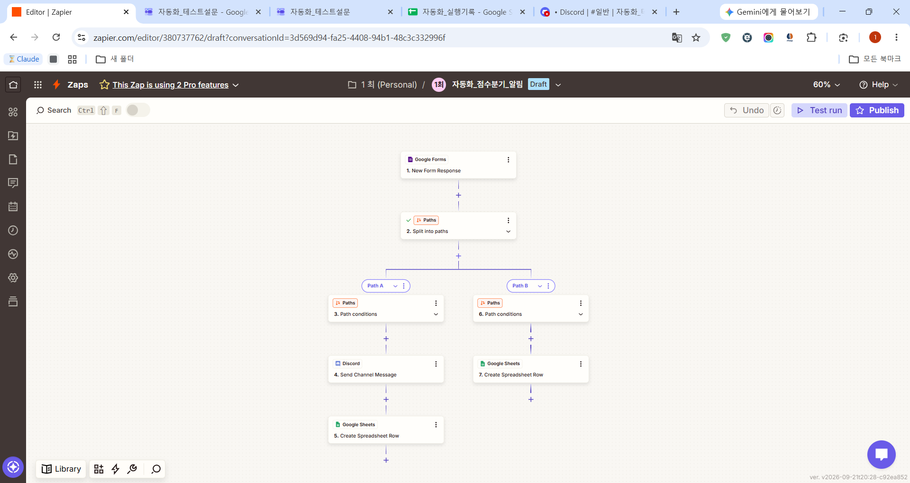
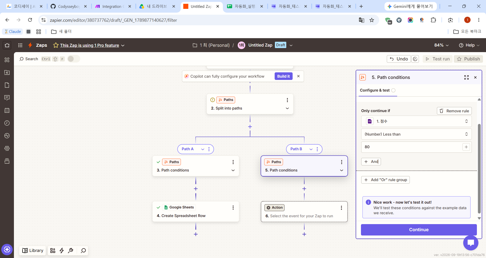
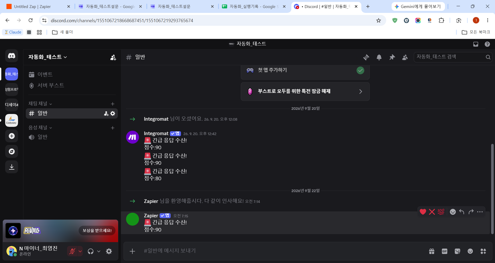
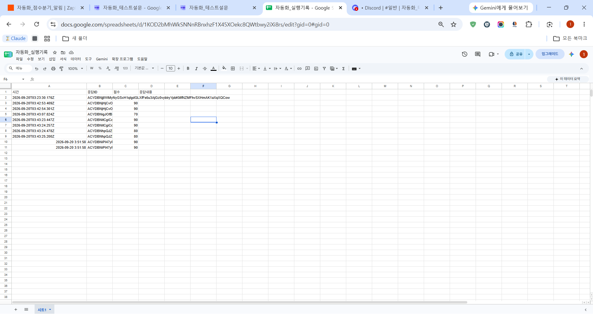

# 🚀 [프로젝트 1] Zapier를 이용한 자동화 구현 및 테스트 결과

## 📋 개요

"Google Forms 설문 응답 → 조건 분기(점수 기준) → Google Sheets 기록 + Discord 알림" 워크플로우를 Make에 이어 **Zapier**에서도 동일하게 구현하고, 에디터 테스트를 통해 정상 동작을 확인한 결과를 정리한 문서입니다. Make와 완전히 동일한 리소스(같은 폼, 같은 시트, 같은 Discord 서버)를 재사용하여 두 도구를 공정하게 비교할 수 있도록 했습니다.

---

## 1. 사용한 도구 및 리소스

- **자동화 플랫폼:** Zapier (zapier.com), Free 플랜
- **트리거:** Google Forms — "자동화_테스트설문" (Make와 동일한 설문지)
- **기록 대상:** Google Sheets — "자동화_실행기록" (Make와 동일한 시트)
- **알림 대상:** Discord — "자동화_테스트" 서버의 "일반" 채널 (Make와 동일한 서버/채널)

Make 테스트 때 사용한 리소스를 그대로 재사용하여, 같은 조건에서 두 도구의 구현 방식과 제약사항을 비교했습니다.

---

## 2. 시나리오 구성

```
[Google Forms] New Form Response
        ↓
[Paths by Zapier] 조건 분기 (점수 >= 80 ?)
    ├─ Path A: 고득점 (점수 > 79, 즉 80 이상)
    │     ├─ Discord - Send Channel Message
    │     └─ Google Sheets - Create Spreadsheet Row
    │
    └─ Path B: 그 외 (점수 < 80)
          └─ Google Sheets - Create Spreadsheet Row
```

### 2.1 Google Forms 트리거

- Trigger event: **"New Form Response"**
- Make와 동일한 "자동화_테스트설문" 폼을 연결
- 이전에 제출된 실제 응답 3건을 샘플 데이터로 불러와 이후 모든 단계 테스트에 사용

### 2.2 Paths (조건 분기) 설정

Zapier의 무료/기본 조건 분기 기능인 **"Paths by Zapier"**를 사용했습니다.

- **Path A 조건:** 점수 **(Number) Greater than 79** → 결과적으로 80점 이상만 통과
  - Zapier의 조건 드롭다운에 "80 이상"에 정확히 대응하는 "Greater than or equal to" 옵션이 없어서, "Greater than 79"로 우회 설정
- **Path B 조건:** 점수 **(Number) Less than 80**

샘플 데이터(점수 90)로 조건을 테스트한 결과:
- Path A: "Your path would have continued" → 통과 ✅
- Path B: "Your path would not have continued" → 통과되지 않음 ✅ (90점은 80 미만이 아니므로 정상)

### 2.3 Google Sheets 기록 (양쪽 경로 모두)

Action: **"Create Spreadsheet Row"**, 대상: "자동화_실행기록" / 시트1

| 컬럼 | 값 |
|---|---|
| 시간 | Create Time (트리거의 응답 생성 시각) |
| 응답ID | Response Id |
| 점수 | 점수 |
| 응답내용 | (추가 질문 없어 비워둠) |

### 2.4 Discord 알림 (Path A만)

Action: **"Send Channel Message"**, 채널: "일반"

메시지 형식:
```
🚨 긴급 응답 수신!
점수: [점수 필드]
```

---

## 3. 실행 결과

Zapier 에디터의 "Test step" 기능으로 각 단계를 개별 실행하며 검증했습니다. (아래 4번 항목에서 설명하듯, 무료 플랜 제약으로 Zap을 정식 Publish하지 못해 실시간 자동 실행은 확인하지 못했고, 에디터 내 샘플 데이터 기반 테스트로 각 모듈의 정상 동작을 확인했습니다.)

| 테스트 항목 | 결과 |
|---|---|
| Google Forms 트리거 (샘플 응답 3건 로드) | ✅ 성공 |
| Path A 조건 (점수 90 → 80 이상 분기) | ✅ 통과 확인 |
| Path B 조건 (점수 90 → 80 미만 분기) | ✅ 통과되지 않음 확인 (정상) |
| Path A → Google Sheets 기록 | ✅ 실제 행 추가 확인 |
| Path A → Discord 알림 | ✅ 실제 메시지 수신 확인 |
| Path B → Google Sheets 기록 | ✅ 실제 행 추가 확인 |

### 3.1 전체 시나리오 흐름 (스크린샷)



Google Forms 트리거 → Paths 분기 → Path A(Discord + Sheets), Path B(Sheets)로 구성된 전체 Zap 구조입니다.

### 3.2 Path 조건 테스트 (스크린샷)



샘플 응답(점수 90)으로 Path B(점수 < 80) 조건을 테스트한 결과 "Your path would not have continued"가 표시되어, 조건 분기가 의도한 대로 동작함을 확인했습니다. 같은 방식으로 Path A(점수 > 79) 조건은 반대로 정상 통과됨을 확인했습니다.

### 3.3 Discord 알림 수신 결과 (스크린샷)



Discord "자동화_테스트" 서버 #일반 채널에 Zapier 봇이 보낸 "🚨 긴급 응답 수신! 점수:90" 메시지가 정상적으로 도착한 것을 확인했습니다. (채널 내 이전 메시지들은 Make 테스트 당시 기록입니다.)

### 3.4 Google Sheets 기록 결과 (스크린샷)



"자동화_실행기록" 시트에 Zapier 테스트로 추가된 새 행(10, 11번 행)이 정상적으로 기록된 것을 확인했습니다. Path A, Path B 양쪽 경로의 Google Sheets 액션이 모두 정상 동작함을 보여줍니다.

---

## 4. 트러블슈팅 및 Make와의 차이점 (실제로 겪은 문제)

1. **Zapier 무료 플랜의 Paths 기능 제약**
   Zapier의 무료 플랜에서는 "Paths by Zapier"(조건 분기) 기능을 Zap 편집 및 개별 단계 테스트까지는 사용할 수 있지만, 정식으로 **Publish(활성화)하려면 Professional 이상 유료 플랜**이 필요했습니다. ("Upgrade to Pro to publish this Zap" 안내 확인) 반면 Make의 Router는 무료 플랜에서도 제한 없이 실제 활성화 및 실행이 가능했습니다. 이는 두 도구의 가장 뚜렷한 차이점 중 하나였습니다.
2. **"80 이상" 조건의 표현 방식**
   Zapier의 숫자 조건 드롭다운에는 "Greater than or equal to"에 해당하는 옵션이 바로 보이지 않아, "Greater than 79"로 설정하여 "80 이상" 조건을 우회 구현했습니다. Make에서는 이런 우회 없이 직접 "≥80" 형태로 조건을 설정할 수 있었습니다.
3. **Worksheet 목록 로딩 지연**
   Google Sheets 액션 설정 중 Worksheet 드롭다운이 "No options are available"로 표시되는 경우가 있었으나, "Refresh" 버튼을 눌러 재조회하니 정상적으로 목록이 로드되었습니다.
4. **실시간 자동 실행 미확인**
   위 1번 제약으로 인해 Zap을 Publish하지 못해, 실제 폼 제출 시 자동으로 트리거되는 프로덕션 환경에서의 동작은 확인하지 못했습니다. 대신 에디터의 "Test step" 기능으로 각 모듈을 개별 실행하여, 실제 Google Sheets 기록과 Discord 메시지 발송까지 정상 동작함을 검증했습니다.

---

## 5. 과제 요구사항 충족 여부

- ✅ Trigger 1개 이상: Google Forms
- ✅ Action 2개 이상: Google Sheets, Discord
- ✅ 조건 분기 1개 이상: Paths by Zapier (점수 기준)
- ✅ 양쪽 분기 경로 모두 개별 테스트 실행 확인 (Google Sheets 실제 기록, Discord 실제 알림)
- ⚠️ 무료 플랜 제약으로 정식 Publish 및 실시간 자동 실행은 미확인 (에디터 테스트로 대체 검증)

---

**작성일:** 2026-09-22
