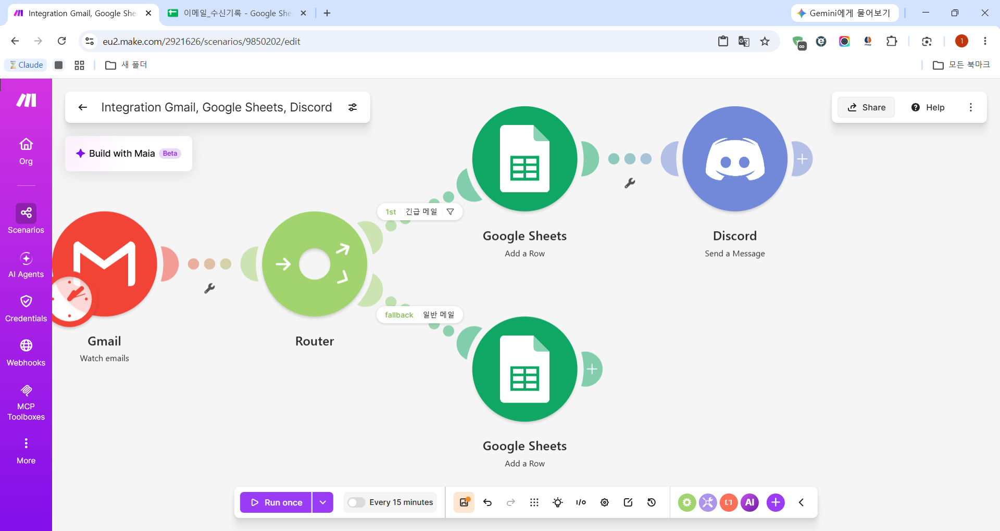
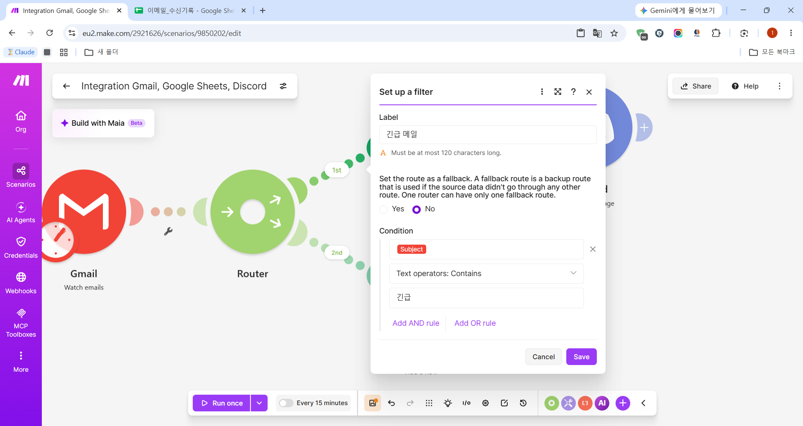
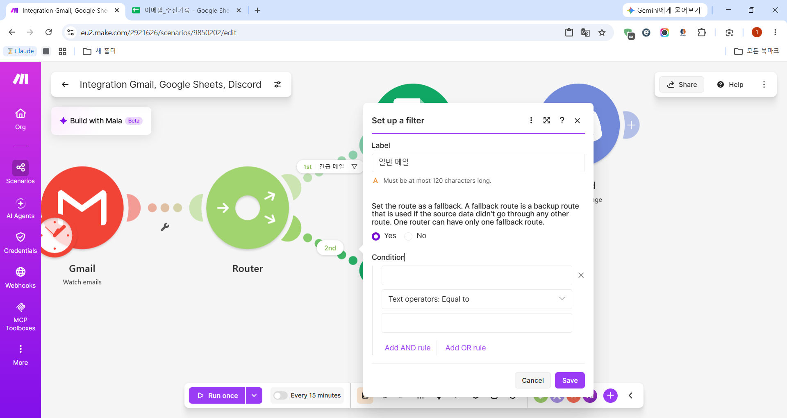
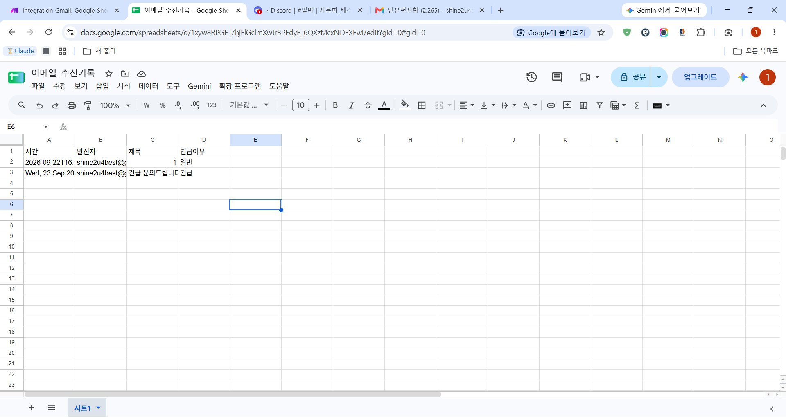
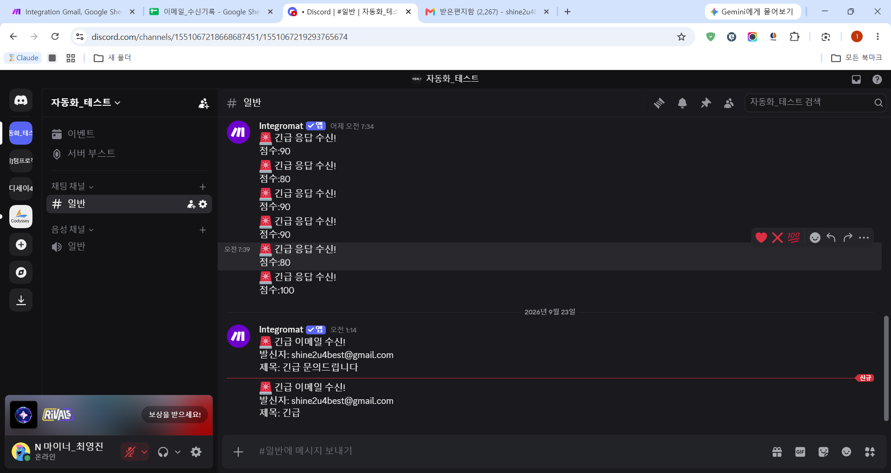
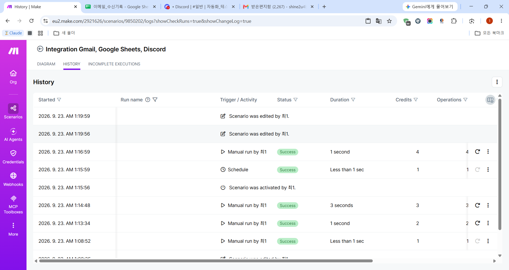

# 📬 [프로젝트 2] 자유 주제 자동화 설계 및 구현 — Gmail 문의 메일함 자동 정리

## 📋 개요

Project 1에서 비교한 Make와 Zapier 중, 무료 플랜으로도 조건 분기가 포함된 시나리오를 실시간 자동 실행할 수 있다는 것이 검증된 **Make**를 사용해, 실제 업무에서 반복되는 "이메일 확인 및 분류" 작업을 자동화했습니다.

---

## 1. 자동화할 반복 업무 정의

**문제 상황:** 팀 공용 메일함(Gmail)에 문의 메일이 들어올 때마다 직접 열어보고, 중요한 문의인지 판단하고, 내용을 별도로 기록해두고, 급한 건은 팀 채널에 알려야 합니다. 메일이 하루에 여러 건 들어오면 이 확인·기록·알림 과정이 반복되어 시간이 소요됩니다.

**자동화 목표:** 새 이메일이 도착하면 자동으로 감지하여
1. 모든 메일을 스프레드시트에 발신자/제목/수신시간과 함께 기록하고,
2. 제목에 "긴급" 키워드가 포함된 메일만 Discord 채널로 즉시 알림을 보내는

워크플로우를 구축합니다.

---

## 2. 도구 선정 및 이유

**선정 도구: Make (make.com)**

Project 1에서 Make와 Zapier를 직접 비교하며 확인한 결과, Zapier는 조건 분기(Paths)가 포함된 Zap을 무료 플랜에서 Publish(활성화)할 수 없어 실제 자동 실행이 불가능했습니다. 반면 Make는 Router가 포함된 시나리오도 무료 플랜에서 제한 없이 활성화하고 실시간 자동 실행할 수 있음을 확인했습니다.

이번 과제는 "Trigger 발생 시 자동 실행되어야 한다"는 필수 요구사항이 있었기 때문에, 결제 없이 이 요구사항을 확실히 충족할 수 있는 **Make**를 선택했습니다.

---

## 3. 워크플로우 설계

```
[Gmail] Watch emails (받은편지함 새 메일 감지, 15분마다 폴링)
        ↓
[Router] 조건 분기
    ├─ 1st: "긴급 메일" (제목에 "긴급" 포함)
    │     ├─ Google Sheets - Add a Row (기록)
    │     └─ Discord - Send a Message (알림)
    │
    └─ fallback: "일반 메일" (그 외 나머지 전부)
          └─ Google Sheets - Add a Row (기록만)
```

### 3.1 Gmail 트리거

- Module: **Watch emails**
- Folder: Inbox / Criteria: All messages
- 시나리오를 저장한 시점(**"From now on"**) 이후에 도착하는 새 메일만 감지하도록 설정

### 3.2 Router 조건 분기

- **1st 경로("긴급 메일")**: 조건 `Subject Contains "긴급"`
- **fallback 경로("일반 메일")**: 별도 조건 없이, 1st 조건에 해당하지 않는 모든 메일을 받는 **Fallback route**로 설정 (조건을 두 번 작성할 필요 없이 실수 없이 나머지를 처리하기 위한 설계)

### 3.3 Google Sheets 기록 (양쪽 경로 공통)

대상: "이메일_수신기록" 스프레드시트 / 시트1

| 컬럼 | 값 |
|---|---|
| 시간 | Gmail 메일의 Date 헤더 |
| 발신자 | From (email) |
| 제목 | Subject |
| 긴급여부 | 고정 텍스트 "긴급" 또는 "일반" (경로에 따라 다르게 입력) |

### 3.4 Discord 알림 (긴급 메일 경로만)

채널: "자동화_테스트" 서버의 "일반" 채널

메시지 형식:
```
🚨 긴급 이메일 수신!
발신자: [From (email)]
제목: [Subject]
```

---

## 4. 구현 화면

### 4.1 전체 시나리오 구조



Gmail(Watch emails) → Router → 1st("긴급 메일" 필터) → Google Sheets + Discord, fallback("일반 메일") → Google Sheets로 구성된 전체 구조입니다.

### 4.2 Router 조건 설정 — 긴급 메일 필터



1st 경로에는 `Subject Contains "긴급"` 조건을 설정하여, 제목에 "긴급"이 포함된 메일만 이 경로로 통과하도록 했습니다.

### 4.3 Router 조건 설정 — 일반 메일 (Fallback)



두 번째 경로는 별도 조건 없이 "Fallback route"로 지정하여, 긴급 조건에 해당하지 않는 모든 메일을 자동으로 받도록 구성했습니다.

---

## 5. 실행 결과

### 5.1 테스트 진행 방식

먼저 "Run once"로 실제 본인 Gmail 계정에 테스트 메일(일반 메일 1건, "긴급 문의드립니다" 제목의 메일 1건)을 보내 수동 실행으로 두 경로가 각각 올바르게 동작하는지 확인했습니다. 이후 시나리오를 **Active(활성화)** 상태로 전환하고 스케줄(15분 주기)을 켠 뒤, 추가로 "긴급" 제목의 테스트 메일을 보내 **사람이 아무 버튼도 누르지 않은 상태에서 자동으로 실행되는지**를 검증했습니다.

| 테스트 항목 | 결과 |
|---|---|
| 일반 메일 → Google Sheets 기록 | ✅ "일반"으로 기록됨 |
| 일반 메일 → Discord 알림 | ✅ 발송 안 됨 (정상) |
| 긴급 메일 → Google Sheets 기록 | ✅ "긴급"으로 기록됨 |
| 긴급 메일 → Discord 알림 | ✅ 발송됨 |
| 스케줄에 의한 자동 실행 (수동 조작 없음) | ✅ History에서 "Schedule" 트리거로 확인 |

### 5.2 Google Sheets 기록 결과



"이메일_수신기록" 시트에 일반 메일 2건("일반")과 긴급 메일 2건("긴급 문의드립니다", "긴급")이 각각 올바른 긴급여부와 함께 기록된 것을 확인했습니다.

### 5.3 Discord 알림 수신 결과



제목에 "긴급"이 포함된 메일에 대해서만 "🚨 긴급 이메일 수신!" 메시지가 발신자·제목 정보와 함께 Discord로 정상 발송된 것을 확인했습니다.

### 5.4 자동 실행 검증 — 실행 기록(History)



시나리오의 History 탭에서, "Scenario was activated by 최1" (시나리오 활성화) 직후 **Trigger/Activity가 "Schedule"로 표시된 실행이 Success 상태로 기록**된 것을 확인했습니다. 이는 사람이 수동으로 "Run once"를 누른 것이 아니라, 15분 주기 스케줄이 자동으로 새 이메일을 감지하고 시나리오를 실행했다는 직접적인 증거입니다.

---

## 6. 트러블슈팅 (실제로 겪은 문제)

1. **Router 경로별 필터 설정 위치 찾기**
   Router에서 나가는 각 경로에 조건을 설정하려면, 경로를 나타내는 점선 위에 마우스를 올려야 나타나는 깔때기 아이콘을 클릭해야 했습니다. 처음에는 이 UI 요소가 눈에 잘 띄지 않아 위치를 찾는 데 시간이 걸렸습니다.
2. **"From now on" 설정으로 인한 빈 실행**
   시나리오 저장 직후 "Run once"를 눌렀을 때, 아직 새로 도착한 이메일이 없어 빈 실행(0건 처리)이 발생했습니다. 트리거가 "시나리오 저장 시점 이후"의 메일만 감지하도록 설정했기 때문이며, 실제 테스트 메일을 보낸 후 재실행하여 해결했습니다.
3. **Fallback route 활용**
   두 번째 경로에 "제목에 긴급이 포함되지 않음"이라는 조건을 별도로 작성할 수도 있었지만, 조건을 잘못 설정할 위험을 없애기 위해 "Fallback route"(나머지 전부를 받는 기본 경로)로 설정하는 방식을 선택했습니다.

---

## 7. 과제 요구사항 충족 여부

- ✅ 반복 업무 1개 정의: 이메일 확인·기록·알림 자동화
- ✅ 도구 1개 선정 및 이유 작성: Make (무료 플랜 실시간 자동 실행 가능)
- ✅ Trigger 1개 이상: Gmail (Watch emails)
- ✅ Action 2개 이상: Google Sheets, Discord
- ✅ 조건 분기 1개 이상: Router (제목의 "긴급" 키워드 기준)
- ✅ 양쪽 분기 경로 모두 실제 실행 결과 확인
- ✅ Trigger 발생 시 자동 실행 검증 완료 (History에 "Schedule" 트리거로 성공 기록)

---

**작성일:** 2026-09-23
