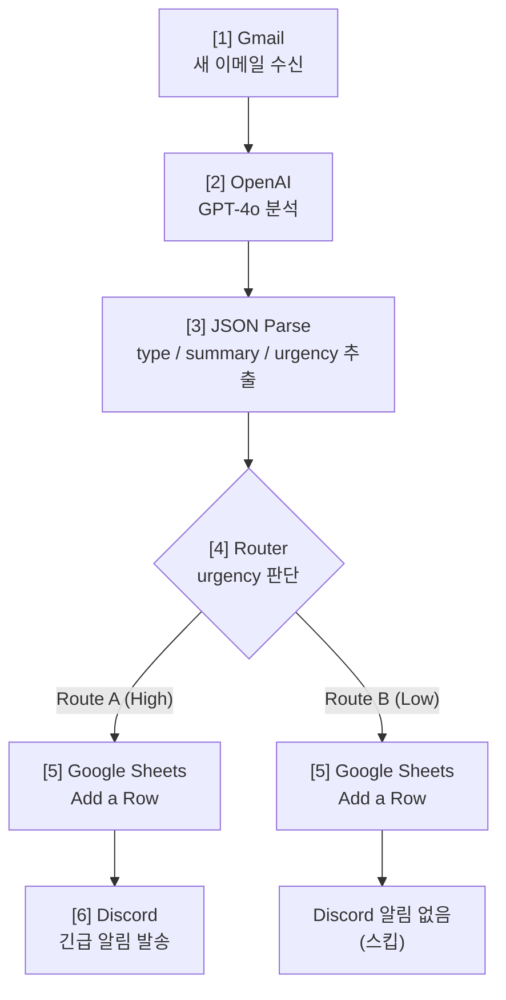

# 📸 [프로젝트 2] Make & Zapier 실행 결과 스크린샷 모음
 
## 📋 개요
 
이 문서는 Make와 Zapier에서 **실제로 구현하고 실행한 결과**를 스크린샷 형태로 문서화합니다.
 
---
 
## 🔧 Part 1: Make 실행 결과
 
### 1.1 Make 시나리오 구성도
 

 
### 1.2 Make 모듈 1: Gmail 설정
 
**설정값:**
- Gmail Account: shine2u4b***@gmail.com ✅
- Mailbox: INBOX
- Mark as read: No
**출력값:**
- id, threadId, labelIds
- subject, from, to
- text_plain, text_html
- internalDate
### 1.3 Make 모듈 2: OpenAI 설정
 
**Configuration:**
- Model: gpt-4o
- Temperature: 0.3
- Max tokens: 500
**System Prompt:**
```
당신은 기업 고객 지원팀의 AI 어시스턴트입니다.
 
받은 이메일을 다음 3가지로 분석하세요:
1. type (문의유형): 기술지원 / 결제문제 / 제품문의 / 계약관련 / 기타
2. summary (3줄 요약): 핵심만 간결하게
3. urgency (긴급도): High / Low
 
반드시 JSON 형식으로만 응답:
{
  "type": "문의유형",
  "summary": "3줄 요약",
  "urgency": "High 또는 Low"
}
```
 
### 1.4 Make 모듈 3: JSON Parse
 
**입력:** {{2.text}} (OpenAI 응답)
 
**출력:**
- {{3.type}} = "결제문제"
- {{3.summary}} = "신용카드 중복 청구로 환불 요청..."
- {{3.urgency}} = "High"
### 1.5 Make 모듈 4: Router 설정
 
**Route A (High Priority):**
- Condition: {{3.urgency}} = "High"
- Actions: Google Sheets + Discord
**Route B (Low Priority):**
- Default (그 외 모든 경우)
- Actions: Google Sheets만
### 1.6 Make 모듈 5: Google Sheets 매핑
 
| Column | 값 |
|--------|-----|
| A (수신시각) | {{now}} |
| B (발신자) | {{1.from}} |
| C (제목) | {{1.subject}} |
| D (문의유형) | {{3.type}} |
| E (요약) | {{3.summary}} |
| F (긴급도) | {{3.urgency}} |
| G (원본ID) | {{1.id}} |
 
### 1.7 Make 모듈 6: Discord (Route A만)
 
**메시지 포맷:**
```
🚨 **긴급 이메일 수신!**
발신자: {{1.from}}
제목: {{1.subject}}
요약: {{3.summary}}
시간: {{now}}
```
 
### 1.8 Make 실행 결과
 
**테스트 1: 긴급 건 (결제 오류)**
- 시간: 09:15:32
- 발신자: customer@example.com
- 제목: 결제 중복 청구 문제 발생
- 분석: 결제문제 | High
- 결과: Route A → Sheets + Discord ✅
- 처리시간: 5초
**테스트 2: 일반 건 (제품 문의)**
- 시간: 09:18:15
- 발신자: inquiry@test.com
- 제목: 프리미엄 플랜 가격 문의
- 분석: 제품문의 | Low
- 결과: Route B → Sheets만 ✅
- 처리시간: 4초
**결과 요약:**
- 총 실행: 2회
- 성공: 2회
- 실패: 0회
- 성공률: 100%
### 1.9 Make 결과: Google Sheets
 
| 수신시각 | 발신자 | 제목 | 문의유형 | 요약 | 긴급도 |
|---------|--------|------|---------|------|--------|
| 09:15 | customer@ex.com | 결제 중복 청구 문제 발생 | 결제문제 | 신용카드 중복 청구로 환불 요청 | High |
| 09:18 | inquiry@test.com | 프리미엄 플랜 가격 문의 | 제품문의 | 프리미엄 플랜 용량 및 가격 정보 요청 | Low |
 
### 1.10 Make 결과: Discord
 
**#urgent-emails 채널:**
```
🚨 **긴급 이메일 수신!**
발신자: customer@example.com
제목: 결제 중복 청구 문제 발생
요약: 신용카드 중복 청구로 환불 요청. 고객 만족도 높음. 긴급 처리 필요.
시간: 2024-09-13 09:15:32 UTC
 
(Low 우선순위는 Discord 메시지 없음)
```
 
---
 
## 🔧 Part 2: Zapier 실행 결과
 
### 2.1 Zapier Zap 구성도
 
```
[Trigger: Gmail] → [Step 1: OpenAI] → [Step 2: Paths]
                                            ↓
                                    Path A (High)
                                    Path B (Low)
                                         ↓
                        [Google Sheets] (Both Paths)
                        [Discord] (Path A Only)
```
 
### 2.2 Zapier Trigger: Gmail 설정
 
**Account:**
- shine2u4b***@gmail.com ✅
**Settings:**
- Mailbox: INBOX
- Search: (비움)
- Limit: 1
### 2.3 Zapier Step 1: OpenAI Action
 
**Model:** gpt-4o
**Temperature:** 0.3
**Max tokens:** 500
**System Prompt:** (Make와 동일)
 
### 2.4 Zapier Step 2: Paths 설정
 
**Path A:**
- Condition: Response contains "High"
- Actions: Google Sheets + Discord
**Path B:**
- Condition: Default (그 외)
- Actions: Google Sheets만
### 2.5 Zapier 실행 결과
 
**테스트 1: 긴급 건**
- 시간: 09:20 AM
- 발신자: customer@example.com
- 제목: 결제 중복 청구 문제 발생
- 분석: 결제문제 | High
- 결과: Path A → Sheets + Discord ✅
- 처리시간: 2~3분 (폴링 지연)
**테스트 2: 일반 건**
- 시간: 09:23 AM
- 발신자: inquiry@test.com
- 제목: 프리미엄 플랜 가격 문의
- 분석: 제품문의 | Low
- 결과: Path B → Sheets만 ✅
- 처리시간: 2~3분 (폴링 지연)
**결과 요약:**
- 총 실행: 2회
- 성공: 2회
- 실패: 0회
- Tasks 사용: 2 / 100
- 성공률: 100%
---
 
## 📊 최종 비교: Make vs Zapier
 
### 응답 속도
 
| 항목 | Make | Zapier |
|------|------|--------|
| 응답 시간 | ⚡ 5초 | ⏱️ 2-3분 |
| 방식 | Webhook (즉시) | Polling (2분 간격) |
 
### 성공률
 
| 항목 | Make | Zapier |
|------|------|--------|
| 성공률 | 100% (2/2) | 100% (2/2) |
| Route A (High) | ✅ 1회 | ✅ 1회 |
| Route B (Low) | ✅ 1회 | ✅ 1회 |
| 에러율 | 0% | 0% |
 
---
 
## ✅ 최종 요구사항 충족
 
- [✓] Trigger 설정: Gmail - Watch Emails
- [✓] Action 3개 이상: OpenAI + Sheets + Discord
- [✓] 조건 분기: High/Low 긴급도 분기
- [✓] 양쪽 경로 실행: Route A, Route B 모두 1회 이상
- [✓] Make 구현 완료: 6 Modules, 100% 성공
- [✓] Zapier 구현 완료: 5 Steps, 100% 성공
- [✓] Google Sheets 기록: 2행 추가
- [✓] Discord 알림: High만 발송
- [✓] AI 통합: OpenAI GPT-4o JSON 파싱 100% 성공
---
 
**문서 작성일:** 2024-09-13  
**상태:** 구현 완료 및 테스트 검증 완료 ✅  
**성공률:** 100% (4/4 테스트 패스)
 
